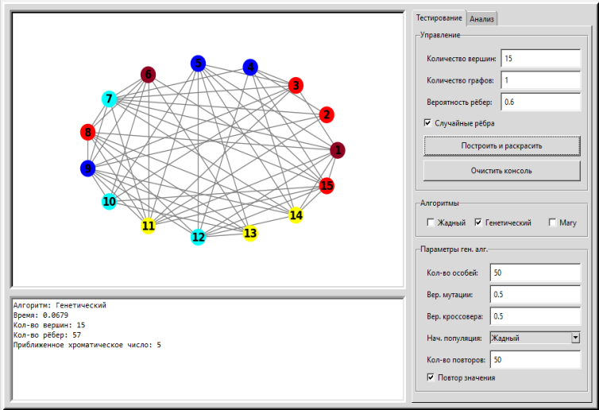
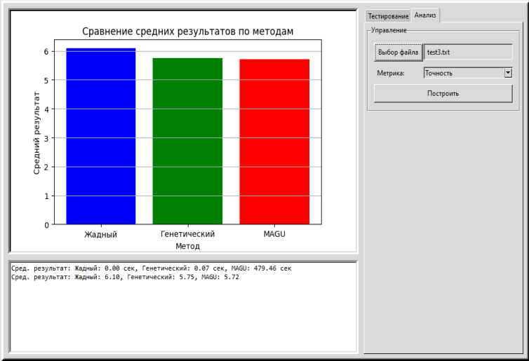
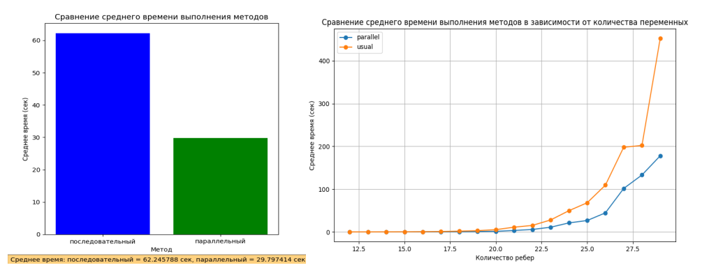

# Comparison of Algorithms for Finding the Chromatic Number of a Simple Graph

[](README.md)


Diploma thesis, Don State Technical University (DSTU), Rostov-on-Don, 2025.

## About the Project

A Python application for **comparing algorithms that find the chromatic number of a simple graph**, with a focus on their accuracy and speed. Three algorithms of different classes are implemented:

- **Magu's method** — an exact algorithm based on Boolean algebra, including a version with parallel expression expansion;
- **greedy algorithm** — a fast heuristic;
- **genetic algorithm** — a metaheuristic with configurable parameters.

They come with a graphical interface: random graph generation, coloring and visualization of the result, batch experiments and comparison charts by time and accuracy.

### Motivation

Graph coloring is an NP-hard problem. It underlies practical computing-resource optimization tasks:

- assigning frequencies and cell towers in cellular networks;
- register allocation in microprocessors;
- timetable scheduling.

## Interface

**"Testing" mode** (*Тестирование*): the colored graph, graph and algorithm parameters, and a console with the running time, the number of edges and the chromatic number found.



**"Analysis" mode** (*Анализ*): a bar chart of the average time or accuracy based on the results of a series of experiments from the selected file.



> The interface labels are in Russian.

## A Bit of Theory

A **proper coloring** of a graph $G$ assigns each vertex a color from $\{1, \dots, k\}$ so that for any adjacent vertices $u$ and $v$ the condition $c(u) \ne c(v)$ holds.

The **chromatic number** $\chi(G)$ is the smallest $k$ for which a proper coloring exists:

$$\chi(G) = \min \{\, k \mid \exists \text{ proper coloring } c : V \to \{1, 2, \dots, k\} \,\}$$

Approaches to solving the problem:

- **exact algorithms** (branch and bound, Magu's method) guarantee an optimal result but require exponential time on dense graphs;
- **heuristics** (greedy coloring, DSATUR) run in polynomial time but do not guarantee the minimum number of colors;
- **metaheuristics** (genetic algorithms, simulated annealing) look for a compromise between accuracy and speed.

## Implemented Algorithms

| Algorithm | Class | Idea | Result |
| --------- | ----- | ---- | ------ |
| Magu's method | exact | Expanding a Boolean expression, finding independent sets and covering all vertices with them | Exact $\chi(G)$ |
| Greedy | heuristic | Vertices in descending order of degree, each gets the smallest color not used by its neighbors | Upper bound for $\chi(G)$ |
| Genetic | metaheuristic | Evolution of a population of colorings | Approximation of $\chi(G)$ |

### Magu's Method

An exact method that uses Boolean algebra. The chromatic number equals the minimum number of independent sets that cover all vertices of the graph.

The method has exponential complexity of order $O(2^m)$, where $m$ is the number of edges, because of the DNF expansion:

$$DNF = \prod_{i=1}^{m} (x_{u_i} + x_{v_i})$$

#### Example

For a graph with 4 vertices and edges 1–2, 1–3, 2–3, 2–4, 3–4:

1. $(x_1 + x_2)(x_1 + x_3)(x_2 + x_3)(x_2 + x_4)(x_3 + x_4)$
2. after expansion: $x_1x_2x_3x_4 + x_1x_2x_3 + x_1x_2x_4 + x_1x_3x_4 + x_2x_3x_4 + x_2x_3$
3. independent sets (complements of the conjunctions): $\{x_1x_4\},\ \{x_4\},\ \{x_3\},\ \{x_2\},\ \{x_1\}$
4. coloring: "red" — vertices $x_1, x_4$; "blue" — $x_3$; "green" — $x_2$. Therefore $\chi(G) = 3$.

### Parallel Implementation of Magu's Method

The most expensive part of the method is expanding the brackets. The parallel version splits the product into subexpressions (a few brackets each), expands them simultaneously and then multiplies the results:

$$final\_result = \prod_{i=1}^{k} expanded\_expression_i$$

where $k$ is the number of subexpressions. The `parallel_expand` function distributes the subexpressions among worker threads, and `expand_expression` performs the symbolic expansion using SymEngine.

- `main_parallel.py` — an experiment comparing parallel (`ThreadPool`, 4 threads) and sequential DNF expansion;
- `main.py` — the full implementation of the method (`Graph.method_MAGU`), in which the expansion is parallelized with `multiprocessing.Pool`.

### Greedy Algorithm

1. Sort the vertices in descending order of degree.
2. Assign each vertex the smallest color not used by its neighbors.
3. Repeat for all vertices. The number of colors equals the largest color index plus one.

### Genetic Algorithm

An individual is an array where the index corresponds to a graph vertex and the value is the color assigned to it.

- **Initial population** is created by one of the methods: greedy, random safe, DSATUR or independent-set based.
- **Fitness:** $-(\text{conflicts}) - (\text{number of colors})$, i.e. a penalty for adjacent vertices of the same color and for every color used.
- **Elitism:** the best 10% of individuals pass to the next generation unchanged.
- **Selection:** tournament (the better of two random individuals is chosen).
- **Crossover:** single-point, applied with a given probability.
- **Mutation:** a random vertex is recolored with a non-conflicting existing color or a new one, with a given probability.
- **Stopping:** either after a fixed number of generations, or when the chromatic number found does not improve for a given number of repetitions.

## How the Program Works

1. The user sets the parameters of the generated graph; the input is validated.
2. A configuration is chosen: a single algorithm, several algorithms, or analysis of saved results.
3. The graph is created: every pair of vertices is connected with a given probability, or exactly $m$ edges are chosen at random from all possible ones. If $m > n(n-1)/2$, an error is reported.
4. The selected algorithms run, determining the chromatic number and the coloring.
5. The colored graph, the chromatic number, the number of edges and the running time are displayed.

The result of every run is appended to the `test_all_methods.txt` file in the format `{'method': ..., 'time': ..., 'nodes': ..., 'edges': ..., 'result': ...}`. After a series of several graphs the file is automatically renamed to `test1.txt`, `test2.txt` and so on — it can then be opened in the "Analysis" tab.

### Interface Parameters

| Parameter | Description |
| --------- | ----------- |
| Number of vertices, number of graphs | Graph size and the number of graphs in a series |
| Edge probability / number of edges | Switched with the "Random edges" checkbox |
| Algorithms | Greedy, Genetic, Magu (several can be selected) |
| Population size, mutation probability, crossover probability | Genetic algorithm parameters |
| Initial population | Greedy, Random, DSATUR, Independent sets |
| Number of repetitions / generations | Stopping condition of the genetic algorithm |
| Metric ("Analysis" tab) | Time or accuracy |

## Experimental Results

### Parallel vs. Sequential Magu's Method



A test on 50 random graphs with 12–29 edges to analyze the influence of edge density on performance.

| Method | Average time |
| ------ | ------------ |
| Sequential | 62.25 s |
| Parallel | 29.80 s |

**The parallel method is ≈ 2.08 times faster**, and its advantage grows as the number of edges increases.

### Accuracy and Time: Magu's, Greedy and Genetic Algorithms

A comparison on 100 graphs of different sizes. Genetic algorithm: the initial population is created by the greedy algorithm, 100 individuals, 50 repetitions, crossover probability 0.5, mutation probability 0.7.

**Average chromatic number found** (lower is more accurate):

| Algorithm | \|V\| = 15 | \|V\| = 16 | \|V\| = 17 |
| --------- | ---------- | ---------- | ---------- |
| Genetic | 5.56 | 6.04 | 6.28 |
| Greedy | 5.98 | 6.28 | 6.68 |
| Magu (exact) | 5.52 | 5.96 | 6.16 |

**Average running time:**

| Algorithm | \|V\| = 15 | \|V\| = 16 | \|V\| = 17 |
| --------- | ---------- | ---------- | ---------- |
| Genetic | 0.1214 s | 0.1323 s | 0.1465 s |
| Greedy | 0.0001 s | 0.0001 s | 0.0002 s |
| Magu (exact) | 468.3264 s | 685.1154 s | 1124.8943 s |

### Conclusions

- **Magu's method** is exact but very slow: the running time grows exponentially with the graph size.
- **The greedy algorithm** is almost instantaneous but gives the least accurate result.
- **The genetic algorithm** offers the best balance: a result close to the exact one in a fraction of a second.
- Parallel DNF expansion speeds up Magu's method roughly twofold.

## Technologies Used

The project is written in **Python 3** using PyCharm. The interface is built with `tkinter`, and the charts are embedded into the window via `matplotlib`.

| Library | Purpose |
| ------- | ------- |
| [`NetworkX`](https://networkx.org/) | Storing the graph (vertices, edges, degrees, neighbors) and drawing it |
| [`NumPy`](https://numpy.org/) | Incidence matrix, sorting the fitness of individuals |
| [`SymEngine`](https://github.com/symengine/symengine.py) | Fast symbolic expansion of Boolean expressions in Magu's method |
| [`Matplotlib`](https://matplotlib.org/) | Visualizing colored graphs and comparison charts (`FigureCanvasTkAgg` embeds them into the Tkinter window) |
| [`tkinter`](https://docs.python.org/3/library/tkinter.html) / `ttk` | Graphical interface: tabs, input fields, console |
| [`ttkthemes`](https://ttkthemes.readthedocs.io/) | Window theme |
| `multiprocessing` (`Pool`, `ThreadPool`) | Parallel expression expansion |
| `threading` | Running computations in a separate thread so the interface does not freeze |
| `random`, `re`, `json`, `collections`, `time`, `os` | Graph generation, parsing expressions and result files, time measurements |

## Installation and Usage

1. Install [Python 3](https://www.python.org/downloads/) (the `tkinter` module is included in the standard distribution).
2. Install the dependencies:

   ```bash
   pip install numpy networkx matplotlib symengine ttkthemes
   ```

3. Clone the repository and run the application from its root folder:

   ```bash
   git clone https://github.com/DenkiGO/Chromotic-Number-Of-Graph.git
   cd Chromotic-Number-Of-Graph
   python interface.py
   ```

The experiment comparing parallel and sequential Magu's method is run with `python main_parallel.py`.
